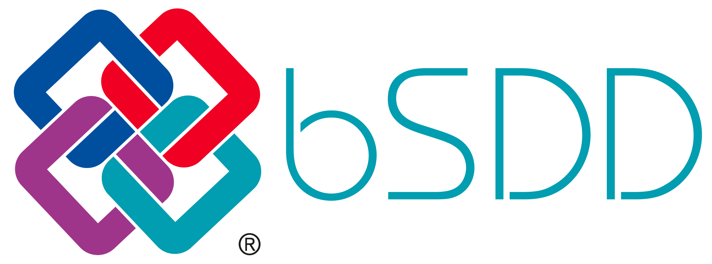

**The buildingSMART Data Dictionary (bSDD)** is an online service for hosting data dictionaries containing classifications, their properties, allowed values, units, translations, etc. It provides a standardized workflow to improve data quality and information consistency.

At the heart of bSDD is a database, where all dictionaries can be related to each other. The main way to access the bSDD is through its [APIs (Application Programming Interfaces)](https://app.swaggerhub.com/apis/buildingSMART/Dictionaries/v1). This is how most BIM software and other apps can use the data stored in the bSDD. Apart from that, there is [the bSDD Search page](https://search.bsdd.buildingsmart.org/), where people can look up the content. Authors can publish content to bSDD through [the API](https://app.swaggerhub.com/apis/buildingSMART/Dictionaries/v1) or [the Management Portal](https://manage.bsdd.buildingsmart.org/). To be able to upload, please fill out [the organisation registration form](https://bsi-technicalservices.atlassian.net/servicedesk/customer/portal/3/group/4/create/25).

More info on https://www.buildingsmart.org/users/services/buildingsmart-data-dictionary/

📢 We inform about planned and recently implemented bSDD updates in this forum topic:
[bSDD Tech Updates](https://forums.buildingsmart.org/t/bsdd-tech-updates/4889).

### Instructions

* [How to upload your data into the bSDD?](/Documentation/bSDD%20import%20tutorial.md)
* [How to structure my data to import to bSDD?](/Documentation/bSDD%20JSON%20import%20model.md)
* Frequently asked questions (what is it for? does it cost? how does it relate to IFC? etc.): [buildingsmart.org/.../buildingsmart-data-dictionary/](https://www.buildingsmart.org/users/services/buildingsmart-data-dictionary/)
* Browse the documentation: [Documentation](Documentation)
* List of tools integrating bSDD: [https://technical.buildingsmart.org/resources/software-implementations/](https://technical.buildingsmart.org/resources/software-implementations/?filter_5%5B%5D=bSDD%20read%20API&filter_5%5B%5D=bSDD%20submit%2Fmanage&filter_5%5B%5D=bSDD%20IFC%20export%20(including%20URIs)&filter_1=&gv_search=&mode=any). This is a self-managed list, so feel free to add missing tools.

### For developers 👩‍💻
* The API URL (not a readable website): https://api.bsdd.buildingsmart.org/ 
* API documentation on Swagger: https://app.swaggerhub.com/apis/buildingSMART/Dictionaries/v1

We also provide a **Test** environment where the latest features are rolled out first and tested. If you want to check it out, here are the equivalent pages:
* Search in the **Test** bSDD: https://search-test.bsdd.buildingsmart.org/
* Upload data to the **Test** database: https://manage-test.bsdd.buildingsmart.org/
* **Test** environment API documentation on Swagger: https://test.bsdd.buildingsmart.org/swagger/
* **Test** environment GraphQL UI for getting data via GraphQL in the UI: [GraphQL UI](https://test.bsdd.buildingsmart.org/graphiql)

### Examples, use-cases, tools and presentations
* 2020.08.08 Classyfing IFC model in SketchUp with bSDD and DigiBase plugin: [Vimeo: bSDD APIv5 SketchUp connection](https://vimeo.com/446417661/ff8b6605d3), and the [source code](https://github.com/DigiBase-VolkerWessels/SketchUp-bsDD-plugin)
* 2021.10.13 Use case with ETIM classification accessible from usBIM software from ACCA: [YouTube: Use case video ETIM-bSDD - usBIM - ACCA Software](https://www.youtube.com/watch?v=KTzJRJkisKk&ab_channel=ETIMInternational)
* 2023.03.16 Recording of bSDD session from InfraBIM Open 2023 in Tampere, Finland. [YouTube video](https://www.youtube.com/watch?v=gie0ryGD3NQ)
     * [00:00:00](https://www.youtube.com/watch?v=gie0ryGD3NQ&t=0s) How to use the buildingSMART Data Dictionary to extend IFC for your needs - Léon van Berlo
     * [00:26:27](https://www.youtube.com/watch?v=gie0ryGD3NQ&t=1587s) How to utilize bSDD in infrastructure owners perspective - case Finnish Transport Infrastructure Agency - Niki Tapper, Teea Kantojärvi
     * [00:55:35](https://www.youtube.com/watch?v=gie0ryGD3NQ&t=3335s) Using IFC 4.3 with bSDD for railway - Giulia Minnucci
* 2020.09.03 Presentation about the bSDD (and relation to IFC): [Presentation](https://www.slideshare.net/berlotti/20200903-the-2020-buildingsmart-data-dictionary-prototype-bsdd)
* 2020.09.15 Video recording of a bSDD workshop, including Revit plugin demo: [Workshop video](https://app.box.com/s/lndnjrbx80n87eg1eq1zhhbqoz8hfmyz/file/720558204462 (start at 1.44.00))
* 2023.03.22 BIMVoice podcast with Artur Tomczak answering bSDD-related questions: [YouTube: BIMvoice with Artur Tomczak: bSDD](https://www.youtube.com/watch?v=VMgaTZhFmjE)
* 2023.08.25 Plannerly [YouTube: The Power of bSDD from buildingSMART](https://www.youtube.com/watch?v=QZHsPEN-L0w)

## Contact us

Need help? Got suggestions? Send an email to <bsdd_support@buildingsmart.org>

or contact the bSDD product manager: Artur Tomczak <artur.tomczak@buildingsmart.org>

